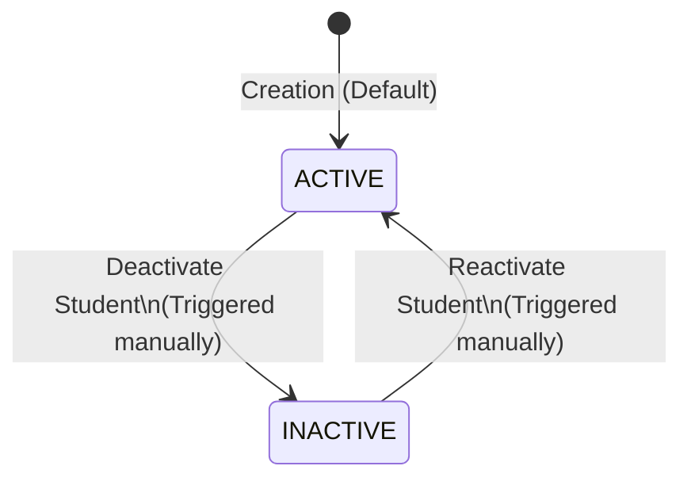
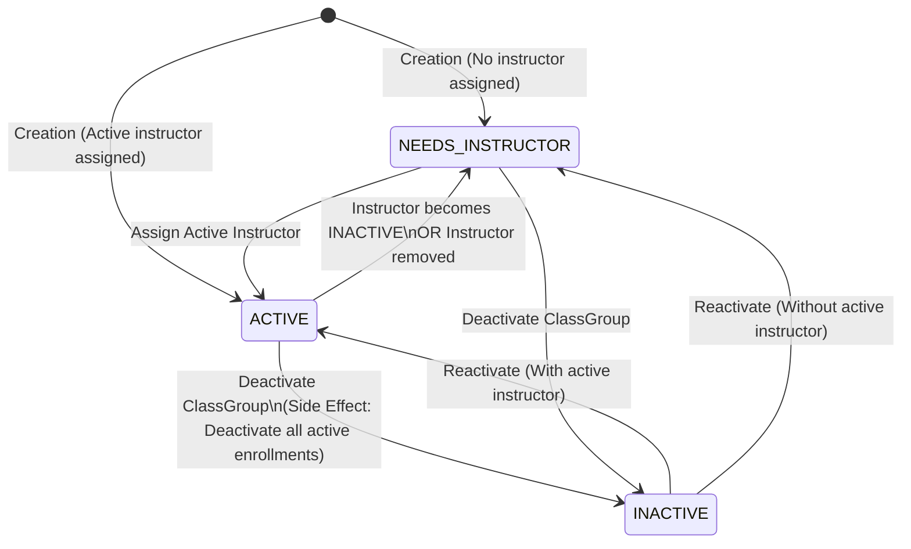
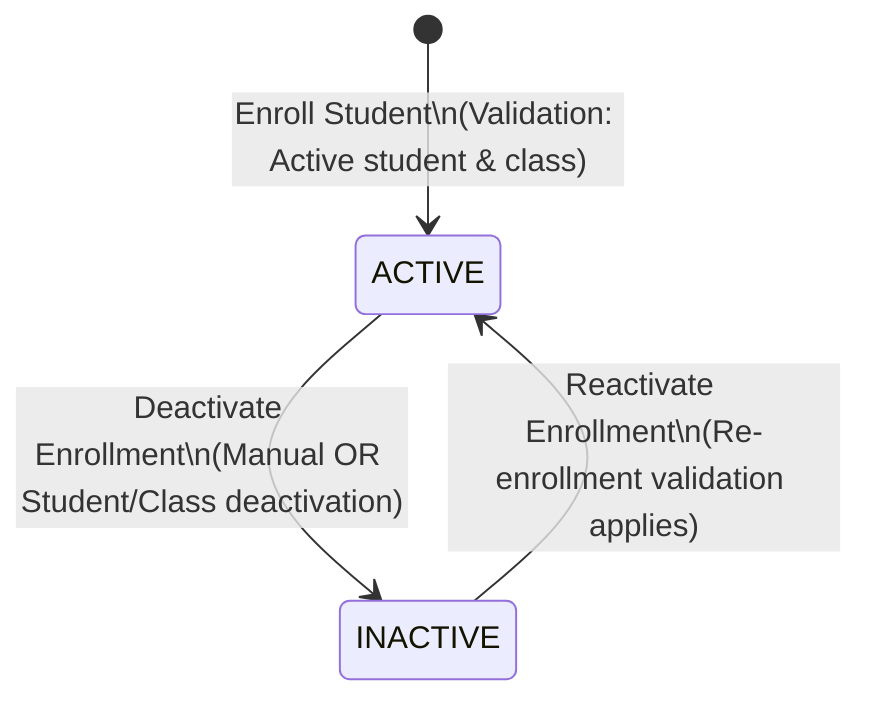
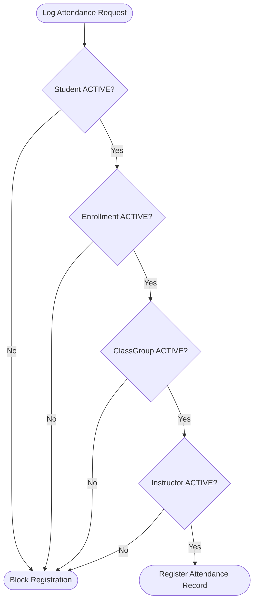
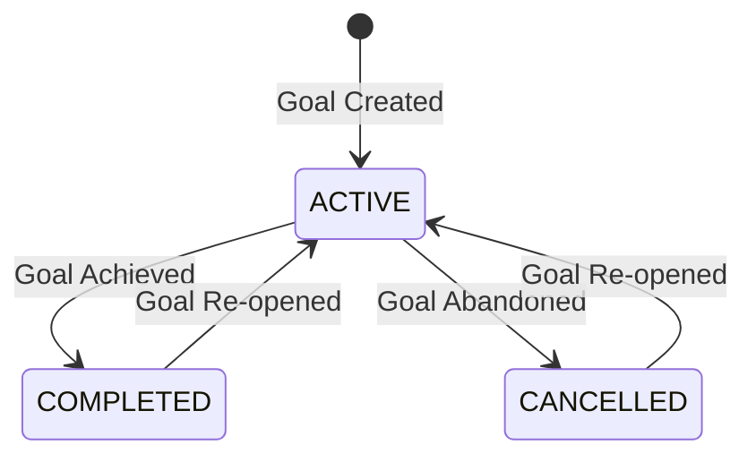

# Corely Pilates Studio SaaS - Entity Lifecycle & Business Rules

This document serves as the official single source of truth for the entity lifecycles, state transitions, validation rules, and cascading behaviors of the Corely Pilates Studio Management SaaS. All future backend, frontend, and database implementations must strictly adhere to these rules.

---

## 1. Executive Summary Table

| Entity | States | Initial State | Primary Cascading Trigger | Key Validation Rule |
| :--- | :--- | :--- | :--- | :--- |
| **Student** | `ACTIVE`, `INACTIVE` | `ACTIVE` | Deactivates all active enrollments. | Must belong to a valid Studio. |
| **Instructor** | `ACTIVE`, `INACTIVE` | `ACTIVE` | Sets related ClassGroups to `NEEDS_INSTRUCTOR`. | Must belong to a valid Studio. |
| **ClassGroup** | `ACTIVE`, `INACTIVE`, `NEEDS_INSTRUCTOR` | `NEEDS_INSTRUCTOR` or `ACTIVE` | Deactivates all active enrollments on deactivation. | Needs active instructor to transition to `ACTIVE`. |
| **Enrollment** | `ACTIVE`, `INACTIVE` | `ACTIVE` | None. | No duplicate active enrollments per student/class. |
| **Attendance** | *Transactional Record* | N/A | None. | Allowed only if student, class, enrollment, and instructor are `ACTIVE`. |
| **Objective** | `ACTIVE`, `COMPLETED`, `CANCELLED` | `ACTIVE` | None. | Student must be `ACTIVE` at creation. |
| **Evaluation** | *Transactional Record* | N/A | None. | Student must be `ACTIVE` at creation. |
| **Evolution** | *Transactional Record* | N/A | None. | Student must be `ACTIVE` at creation. |

---

## 2. Detailed Entity Lifecycles

### 2.1 Student

#### Purpose
Represents a Pilates client registered in a studio. The student profile tracks personal information, goals, clinical evaluations, progress logs, and class attendances.

#### States
* **`ACTIVE`**: The student is fully operational. They can be enrolled in classes, attend sessions, and have new records (objectives, evaluations, evolutions) created.
* **`INACTIVE`**: The student is suspended or has terminated their contract. They cannot attend classes or have active enrollments.

#### State Transitions & Diagram

| Source State | Target State | Triggering Event | Validation / Prerequisites | Cascading Side Effects |
| :--- | :--- | :--- | :--- | :--- |
| `None` | `ACTIVE` | Student Registration | Required profile fields validated. | None. |
| `ACTIVE` | `INACTIVE` | Manual Deactivation | None. | Automatically deactivates all active enrollments. |
| `INACTIVE` | `ACTIVE` | Manual Reactivation | None. | None (past enrollments must be reactivated manually). |

#### Business & Validation Rules
* **Creation Validation**:
  * A student must belong to a valid `Studio`.
  * Full Name and Studio ID are mandatory.
  * Email must be unique within the same Studio.
* **Deactivation Rules**:
  * When a student transitions from `ACTIVE` -> `INACTIVE`, all of their `ACTIVE` enrollments must be automatically set to `INACTIVE`.

#### Historical Data Behavior
* When a student becomes `INACTIVE`, all historical data—including past attendances, completed objectives, physical evaluations, and daily evolutions—**must remain intact and unaltered**. No historic logs are deleted.

#### Dashboard Impact
* **Active Counts**: Inactive students are excluded from the "Active Students" count.
* **Aggregates**: Inactive students' past presence logs are still counted in historical attendance metrics (e.g., "Attendance this month").

---

### 2.2 Instructor

#### Purpose
Represents a professional Pilates instructor who conducts classes, monitors student progress, and records attendance.

#### States
* **`ACTIVE`**: The instructor is available to be assigned to ClassGroups, log attendance, and record evaluations/evolutions.
* **`INACTIVE`**: The instructor is no longer working at the studio or is temporarily suspended. They cannot be assigned to new ClassGroups, and active assignments are revoked.

#### State Transitions & Diagram

| Source State | Target State | Triggering Event | Validation / Prerequisites | Cascading Side Effects |
| :--- | :--- | :--- | :--- | :--- |
| `None` | `ACTIVE` | Instructor Registration | Required profile fields validated. | None. |
| `ACTIVE` | `INACTIVE` | Manual Deactivation | None. | 1. Remove instructor from active ClassGroups. 2. Set ClassGroup status to `NEEDS_INSTRUCTOR`. |
| `INACTIVE` | `ACTIVE` | Manual Reactivation | None. | None. |

#### Business & Validation Rules
* **Creation Validation**:
  * Must belong to a valid `Studio`.
  * Full Name and Studio ID are mandatory.
* **Deactivation Rules**:
  * Deactivating an instructor forces a cascade that removes them from all ClassGroups they are currently assigned to.
  * Any ClassGroup affected by this removal must immediately change its state to `NEEDS_INSTRUCTOR`.

#### Historical Data Behavior
* All historical logs recorded by the instructor (e.g., attendances registered, evolutions written) must be preserved. The instructor's name remains attached to these records for auditing purposes.

#### Dashboard Impact
* **Active Counts**: Inactive instructors are excluded from the "Active Instructors" metric.
* **Class Health**: Active ClassGroups that lose their instructor and transition to `NEEDS_INSTRUCTOR` are flagged on the dashboard to alert studio management.

---

### 2.3 ClassGroup

#### Purpose
Defines a repeating scheduled class occurrence (days of the week, start/end time, capacity limit) conducted by a designated instructor.

#### States
* **`ACTIVE`**: Fully scheduled, has an assigned `ACTIVE` instructor, and is open for student enrollments and daily attendance tracking.
* **`NEEDS_INSTRUCTOR`**: The class schedule is active, but there is no instructor assigned (either created without one, or the assigned instructor was deactivated).
* **`INACTIVE`**: The class schedule is cancelled or suspended. No new enrollments are allowed, and existing enrollments are deactivated.

#### State Transitions & Diagram

| Source State | Target State | Triggering Event | Validation / Prerequisites | Cascading Side Effects |
| :--- | :--- | :--- | :--- | :--- |
| `None` | `NEEDS_INSTRUCTOR` | Class Created without Instructor | None. | None. |
| `None` | `ACTIVE` | Class Created with Instructor | Instructor must be `ACTIVE`. | None. |
| `NEEDS_INSTRUCTOR` | `ACTIVE` | Instructor Assigned | Assigned Instructor must be `ACTIVE`. | None. |
| `ACTIVE` | `NEEDS_INSTRUCTOR` | Instructor Deactivated/Removed | None. | Instructor field set to `null` (or placeholder). |
| `ACTIVE` | `INACTIVE` | Manual Deactivation | None. | Automatically deactivates all active enrollments. |
| `NEEDS_INSTRUCTOR` | `INACTIVE` | Manual Deactivation | None. | Automatically deactivates all active enrollments. |
| `INACTIVE` | `ACTIVE` | Manual Reactivation | Must assign an `ACTIVE` instructor. | None. |
| `INACTIVE` | `NEEDS_INSTRUCTOR` | Manual Reactivation | No active instructor assigned. | None. |

#### Business & Validation Rules
* **Scheduler Validation**:
  * A ClassGroup must have at least one day of the week selected (Monday through Sunday).
  * Start Time must be chronologically before End Time.
  * Capacity must be a positive integer greater than zero.
* **State Restrictions**:
  * A ClassGroup cannot be in the `ACTIVE` state if its instructor field is empty or references an `INACTIVE` instructor.
* **Deactivation Rules**:
  * Transitioning a ClassGroup to `INACTIVE` must automatically transition all its `ACTIVE` enrollments to `INACTIVE`.

#### Historical Data Behavior
* Historical student attendance records associated with the ClassGroup remain saved to preserve billing and session utilization history.

#### Dashboard Impact
* **Active Counts**: Only `ACTIVE` and `NEEDS_INSTRUCTOR` class groups are counted as active operational entities, though only `ACTIVE` class groups count towards active capacity metrics.
* **Occupancy & Capacity**: Inactive class groups are completely excluded from total studio capacity calculations.

---

### 2.4 Enrollment

#### Purpose
Represents a student's formal registration in a specific ClassGroup.

#### States
* **`ACTIVE`**: The student is actively scheduled to attend this class.
* **`INACTIVE`**: The registration is completed, cancelled, or terminated.

#### State Transitions & Diagram

| Source State | Target State | Triggering Event | Validation / Prerequisites | Cascading Side Effects |
| :--- | :--- | :--- | :--- | :--- |
| `None` | `ACTIVE` | New Enrollment Created | 1. Student must be `ACTIVE`. 2. ClassGroup must be `ACTIVE` or `NEEDS_INSTRUCTOR`. 3. Prevent duplicate active enrollments. | None. |
| `ACTIVE` | `INACTIVE` | Manual Cancel/End OR Student Deactivated OR ClassGroup Deactivated | None. | None. |
| `INACTIVE` | `ACTIVE` | Re-enrollment | Same validations as new enrollment. | None. |

#### Business & Validation Rules
* **Duplicate Enrollment Prevention**:
  * A student can only have **one** `ACTIVE` enrollment per ClassGroup. Duplicate active enrollments in the same class group are strictly blocked.
* **Entity Status Validation**:
  * A student who is `INACTIVE` cannot be enrolled.
  * A student cannot be enrolled in an `INACTIVE` ClassGroup.
* **Capacity Warnings/Blocks**:
  * System must check the ClassGroup capacity before creating an active enrollment.

#### Historical Data Behavior
* Inactive enrollments are retained to maintain a history of which classes the student previously attended.

#### Dashboard Impact
* **Occupancy Rate**: Calculated using only `ACTIVE` enrollments against the total capacity of `ACTIVE` class groups.
* **Total Enrollments**: Only `ACTIVE` enrollments are displayed in active enrollment totals on the dashboard.

---

### 2.5 Attendance

#### Purpose
Logs the presence or absence of a student in a specific ClassGroup session on a given calendar date.

#### States
* Attendance is a **Transactional Record (Event)**. It does not have typical lifecycle state transitions, but rather records a static outcome (`present = true` or `present = false`).

#### Lifecycle & Validation Diagram

#### Business & Validation Rules
* **Operational Dependency Validation**:
  * Attendance can only be registered if **all** of the following entities are concurrently `ACTIVE`:
    1. **Student** must be `ACTIVE`.
    2. **Enrollment** linking the student to the class must be `ACTIVE`.
    3. **ClassGroup** must be `ACTIVE`.
    4. **Instructor** assigned to the class group must be `ACTIVE`.
* **Date Restrictions**:
  * Attendance cannot be logged for future dates.

#### Historical Data Behavior
* Attendance records are historical logs. Once recorded, they are **never deleted or modified** by state changes in students, enrollments, instructors, or classes.

#### Dashboard Impact
* Used to compute attendance compliance, weekly/monthly attendance volumes, and student retention metrics.

---

### 2.6 Objective

#### Purpose
Tracks the fitness, posture, or rehabilitation goals established for a student.

#### States
* **`ACTIVE`**: The goal is currently being pursued.
* **`COMPLETED`**: The goal has been successfully achieved.
* **`CANCELLED`**: The goal has been abandoned or superseded.

#### State Transitions & Diagram

| Source State | Target State | Triggering Event | Validation / Prerequisites | Cascading Side Effects |
| :--- | :--- | :--- | :--- | :--- |
| `None` | `ACTIVE` | Goal Creation | Student must be `ACTIVE`. | None. |
| `ACTIVE` | `COMPLETED` | Manual Complete | None. | None. |
| `ACTIVE` | `CANCELLED` | Manual Cancel | None. | None. |
| `COMPLETED` / `CANCELLED` | `ACTIVE` | Manual Re-open | Student must be `ACTIVE`. | None. |

#### Business & Validation Rules
* **Creation Validation**:
  * An objective can only be created or reactivated for an `ACTIVE` student.
  * Title and Start Date are mandatory.

#### Historical Data Behavior
* Completed and cancelled objectives are preserved permanently on the student profile to document their history of progression.

#### Dashboard Impact
* **Goal Progress**: Dashboard tracks the count of `ACTIVE` objectives and `COMPLETED` objectives to show training efficacy.

---

### 2.7 Evaluation

#### Purpose
A point-in-time clinical or physical assessment (weight, height, postural analysis, limitations) of a student.

#### States
* **Transactional Record (Event)**. Once finalized, it remains as an immutable historical record.

#### Business & Validation Rules
* **Creation Validation**:
  * Evaluations can only be created for `ACTIVE` students.
  * Weight and Height must be positive, non-zero values.
  * Evaluation Date must not be in the future.

#### Historical Data Behavior
* Evaluations are never deleted, serving as the baseline and progression markers for the student's physical journey.

#### Dashboard Impact
* Recent evaluations are listed chronologically in the dashboard's "Recent Activity" and monthly evaluation counts.

---

### 2.8 Evolution

#### Purpose
Daily progress notes logged by instructors documenting student performance, exercise variations, pain reports, and general feedback.

#### States
* **Transactional Record (Event)**. Once logged, it represents a permanent clinical timeline entry.

#### Business & Validation Rules
* **Creation Validation**:
  * Evolution logs can only be created for `ACTIVE` students.
  * Title, Description, and Evolution Date are mandatory.
  * Can optionally link to an active `Objective` or `Evaluation` belonging to the same student.

#### Historical Data Behavior
* Evolution history is preserved permanently to maintain a clinical log of the student's sessions.

#### Dashboard Impact
* Aggregated into monthly statistics (e.g., "Evolutions this month") and listed in the dashboard's recent progress feed.

---

## 3. Dashboard Operation Rules

The dashboard serves as the central cockpit for studio operations. It must strictly separate operational metrics from historical analytics based on entity states.

### 3.1 Operational Metric Exclusions
To prevent skewed statistics, the dashboard must filter out inactive operational data:

| Metric | Source Entities Included | Entities Explicitly Excluded |
| :--- | :--- | :--- |
| **Active Students** | Students where `active = true` | Students where `active = false` |
| **Active Instructors** | Instructors where `active = true` | Instructors where `active = false` |
| **Active Class Groups** | ClassGroups where `active = true` | ClassGroups where `active = false` |
| **Total Active Enrollments**| Enrollments where `active = true` | Enrollments where `active = false` |
| **Occupancy Rate** | `(Active Enrollments / Sum of Capacity of Active ClassGroups) * 100` | Inactive enrollments, inactive class group capacities. |

### 3.2 Historical Metric Inclusions
Unlike operational counts, historical and volume-based metrics represent activities that occurred in the past. Therefore, their values **must remain unaffected** by the current active status of the related entities.

* **Attendance Counters**: The counts of "Attendance this week" or "Attendance this month" must compile all attendance records within that timeframe, even if the student, class group, or instructor involved has since been deactivated.
* **Evaluations & Evolutions Counts**: Monthly count metrics must reflect all physical evaluations and evolutions performed in the given date range, regardless of the current status of the student.
